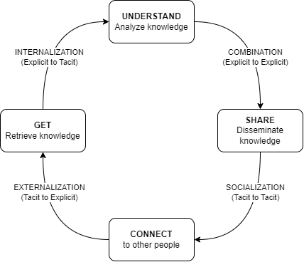
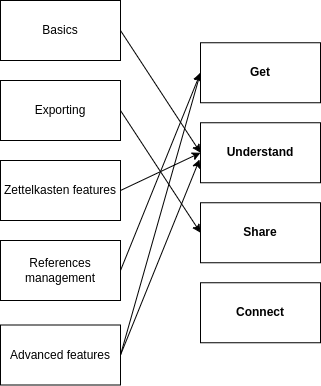

# Why?

## _Raison d'être_ of Personal Knowledge Management (PKM)

- We live in an information society. We are overloaded with information of diverse nature and quality.
- There is more than _information overload_: _tools overload_, _social overload_ and _reference overload_.
- Most individuals are passive against these concerns. However, the digital medium has its very own characteristics we need to embrace to develop a personal.

## What is PKM?

PKM is the field that precisely studies that issue: how, as individuals, can we thrive in the informational age? How can we make the most out of information technologies without feeling overwhelmed?

## Key skills in PKM

- Management
- Lifelong learning
- Communication and interpersonal skills
- Technological fluency
- Forecasting and anticipating

## Key skills in PKM (cont'd)

- Use frameworks, models and conceptual tools to build upon your current KM practices.
- Implement PKM strategies using digital technologies.
- PKM practices are ultimately personal and evolving constructs.
- Reflect about the process, iterate, exchange with others

## Some concrete insights

- Find an equilibrium between _content consumption_ and _content creation_
- Move from _note-taking_ to _note-making_: think about your notes, not just their content
- Showcase your learning: _learn in public_, build a _digital garden_
- View digital tools as opportunities to design new workflows

## The GUSC model

We will use the GUSC model. It can be seen as a concretization of the SECI model.

→ A simple yet powerful model. We need to associate concrete actions to each phase.

## The GUSC model in more details

- **Get**: gather information from different sources
- **Understand**: interpret, combine information into a (personal) whole
- **Share**: produce artifacts to make the learning process visible
- **Connect**: collaborate and exchange with others

## A plethora of tools

`Notion`, `Roam`, `Tana`, `Obsidian`, `Logseq`, `AnyType`, `Affine`, `TiddlyWiki`, `Zettlr`...

- Local vs Web-aware vs Web-based
- FOSS vs Freeware vs Paid
- Specific ↔ Extensible ↔ Malleable
- User-friendly?

→ We will use `Zettlr`

## Advantages of plain text editing

- Lightweight: you can work with just a simple text editor. You can store your files anywhere.
- Easily readable and writable: a whole range of apps work with plain text. It is also easy to manipulate programmatically.
- No lock-in: you can use your text files in different apps for different purposes. You can switch to a new app that better fits your needs seamlessly.
- Teaches you about computing and the _hacker mindset_ in a hands-on way.

# How?

## Goal

→ We will see how `Zettlr` can help us implement strategies for the first 3 steps of the GUSC model (**Get**, **Understand**, **Share**).

`Zettlr` is:

- Free and Open-Source
- Web-aware
- Supported by a community (`Discord`, `Reddit`)
- Specific but plays nicely with other tools (bibliography, export)

## GUSC in ` Zettlr`

## Install ` Zettlr`

- Simply go to the official website: [zettlr.com/download](https://zettlr.com/download)
- Install and open it.
- If you write academic articles, you will need `LaTeX` at some point. Simply use `MikTeX` (this is not the point today).

## `Markdown` syntax

- `# Section heading`

  `## Subsection heading`...

- This is `_emphasized_` and this is `**strong**`
- This is a `- List item`
- This is a `1. Numberred item`
- This is a `[link](https://zettlr.com)`
- This is an ``
- `YAML`: metadata and options

## Basics and Exporting

- Create a new file
- Fill it up with some headings and content.
- You have some shortcut icons (e.g. links and images)
- Left pane: files explorer
- Right pane: outline and more
- Export button: select one of the available formats (except `LaTeX`)

## References: `Zotero` + ` Zettlr`

1. Install `Zotero`. You will manage all your references from here.
2. Install the ` BetterBibTeX` plugin for `Zotero`
3. Export your `Zotero` library
4. Open it in `Zettlr`
5. Type in `@` and select one of your refs.

**Example** [@resnickLifelongKindergartenCultivating2017] and others emphasize the need to develop creativity in computing education.

[@morPracticalDesignPatterns2014] have developed design patterns for implementing technology-enhanced pedagogy.

## References

::: {#refs}
:::

## Zettelkasten in `Zettlr`

- Use #tags.
- Link to other files, such as in [[about_tags]].
- Give unique IDs to files such as [[20231216180452]] Another file

## Graph view:

{width=80%}

## Extending export capabilities

- Change how things look
- Add new export possibilities thanks to `Pandoc`

We will use the Assets dialog: File > Preferences > Manage assets

**Challenge 1: use custom `CSS` to style `HTML` output**

- The given file is `custom.css`.
- Select the `HTML` profile. On line 46, add `custom.css` between the brackets.
- You can also add `css: custom.css` to the YAML on each file you want to export with `custom.css`.

## Extending export capabilities (cont'd)

**Challenge 2: enable export to `PowerPoint` presentations**

- By default, `Zettlr` offers no possibility to export to `.pptx` (`PowerPoint`). However, `pandoc` can do it.
- Create a new profile with `reader: markdown` and `writer: pptx`

**Challenge 3: modify how things look in `docx`, `pptx`, `odt`**

- You can specify a template by adding `reference_doc: template.pptx` to the corresponding profile.
- We provide `custom.docx`, `custom.odt` and `custom.pptx`
- Modify the slide masters in the provided template
- For `docx/odt`, modify the styles.
